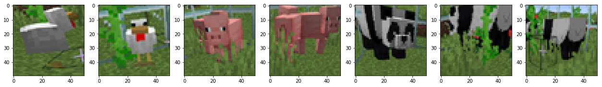
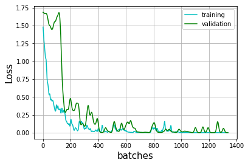
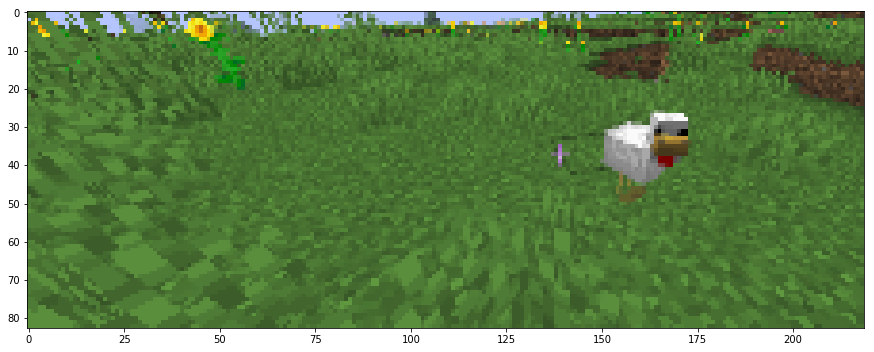
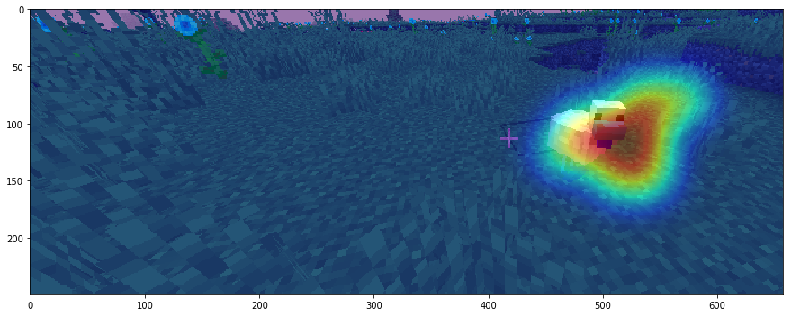

# deep-chicken-terminator
deep learning to track (and possibly kill)  chicken in minecraft :hocho: :chicken:

.


## Step 1 - collecting training data for the deep neural network 

.

* This was mostly just me taking cropped screenshots of animals while playing the game, took about 40 screenshots of each animal.
* The 20 screenshots of each animal were then augmented and got 500 samples of each. 
* The dataset is very small, but it works anyways for now

## Step 2 - training a deep learning model on the samples

.

* The architecture was kept intentionally small so that it keeps a good response time on the live feed
* The dataset had only 2000 images sized at 50*50, so training barely took any time 

## Step 3 - detecting a chicken (or any animal for that matter) from an image

.

* This was done using a custom ```detect_animal_numpy()``` function which iterates through the image with a certain kernel size and a stride size, and feeds each sample to the trained NN (nicknamed hunter)
* A heatmap is then generated from the output of the NN which gives us a probability distribution over the image of a certain animal ( chicken, pig, or panda)
* why use heatmaps instead of rectangles ? because they look cooler.

.


