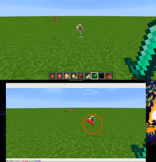

# deep-chicken-terminator
deep learning to track (and possibly kill)  chickens in minecraft :hocho: :chicken:

.


## Step 1 - collecting training data for the deep neural network 

.

* This was mostly just me taking cropped screenshots of animals while playing the game, took about 40 screenshots of each animal.
* The 20 screenshots of each animal were then augmented and got 500 samples of each. 
* The dataset is very small, but it works anyways for now

## Step 2 - training a deep learning model on the samples

.

* The architecture was kept intentionally small so that it keeps a good response time on the live feed
* The dataset had only 2000 images sized at 50*50, so training barely took any time 

## Step 3 - Collecting more training data with the trained model

.

* this is done by saving the frames which give a probaility of over 99% on the pre trained model
* these saved images are again used for further training, which means `hunter()` is getting better and better.

## Step 4 - detecting a and tracking chicken (or any animal for that matter) with the mouse using the trained model


.

* This was done using a custom ```detect_animal_numpy()``` function which iterates through the image with a certain kernel size and a stride size, and feeds each sample to the trained NN (nicknamed hunter)
* A heatmap is then generated from the output of the NN which gives us a probability distribution over the image of a certain animal ( chicken, pig, or panda)
* why use heatmaps instead of rectangles ? because they look cooler.

.

## Step 5 (and probably the final step) - Train `hunter()` to detect fellow villagers and wipe out whole villages

* Chickens are just an excuse, it can be easily modified to shoot arrows on anything that moves.
* This is yet to be done.


